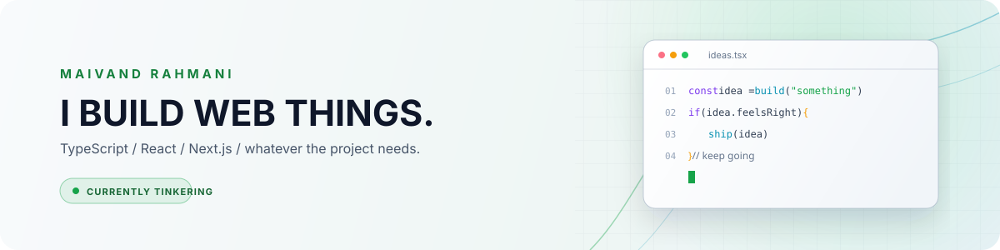
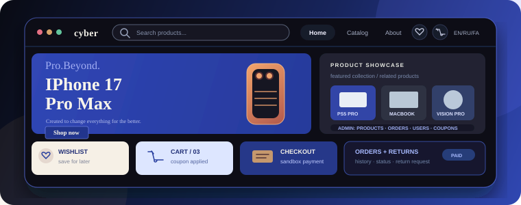
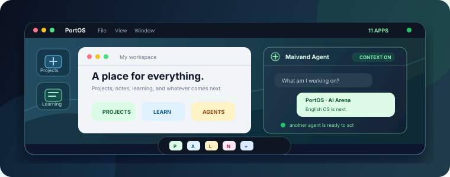
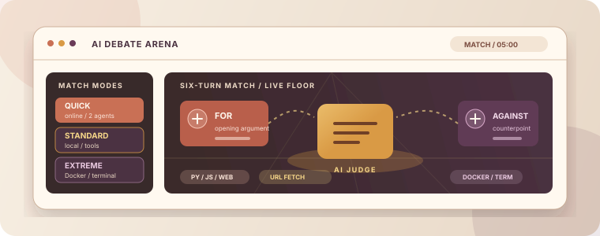
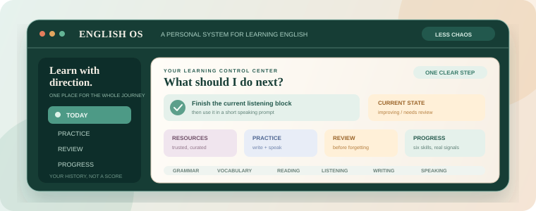

  <a href="https://port-os-seven.vercel.app">
    <picture>
      <source media="(prefers-color-scheme: dark)" srcset="./assets/profile-header.svg" />
      <source media="(prefers-color-scheme: light)" srcset="./assets/profile-header-light.svg" />
      
    </picture>
  </a>

  <a href="https://port-os-seven.vercel.app">Portfolio</a>
  &nbsp;·&nbsp;
  <a href="https://t.me/MaivandR123">Telegram</a>
  &nbsp;·&nbsp;
  <a href="mailto:maivand123r@gmail.com">Email</a>

## Hey, I'm Maivand

I build web apps and product experiments.

I started with frontend work, but I keep wandering into architecture, AI, and
whatever else a project needs. Most of the time I'm using TypeScript, React,
and Next.js.

## Now

AI debate arena is under developement right now.
Its the first really intresting product I'm building with ai.

## Projects

<table>
  <tr>
    <td width="50%" valign="top">
      
      <h3><a href="https://github.com/maivand-rahmani/crazy-eCommerce-project">Crazy eCommerce</a></h3>
      
A full-stack e-commerce platform with a real storefront and a private admin console. It handles products and variants, cart, wishlist, multilingual routes, sandbox checkout, orders and returns, users, coupons, reviews, and a PostgreSQL database behind it.

      
<code>Next.js</code> <code>React</code> <code>Prisma</code> <code>PostgreSQL</code>

      <a href="https://crazy-e-commerce-project.vercel.app">Open the live project →</a>
    </td>
    <td width="50%" valign="top">
      
      <h3><a href="https://github.com/maivand-rahmani/PortOS">PortOS</a></h3>
      
A real browser-based operating system inspired by macOS — with around eleven apps, my projects, my learning space, one agent that knows the context of my work and answers like me, and another agent that can actually do tasks inside the system.

      
<code>Next.js</code> <code>TypeScript</code> <code>Feature-Sliced Design</code>

      <a href="https://port-os-seven.vercel.app">Visit PortOS →</a>
    </td>
  </tr>
  <tr>
    <td width="50%" valign="top">
      
      <h3><a href="https://github.com/maivand-rahmani/ai-debate-arena">AI Debate Arena</a></h3>
      
An AI debate system with three modes: Quick is an online two-agent match in development; Standard runs locally with Python, JavaScript, web search, and URL fetch; Extreme adds Docker and terminal access. Matches can run for up to five minutes before a judge scores the result.

      
<code>Next.js</code> <code>TypeScript</code> <code>AI SDK</code> <code>Vitest</code>

    </td>
    <td width="50%" valign="top">
      
      <h3><a href="https://github.com/maivand-rahmani/English-OS">English OS</a></h3>
      
My attempt to build a personal operating system for learning English. It turns scattered resources, levels, practice, review, and progress into one clear path: what to learn, why now, and what to come back to next. System-first, not lesson-first.

      
<code>Learning system</code> <code>Roadmap</code> <code>Product thinking</code> <code>Next.js</code>

    </td>
  </tr>
</table>

## Things I use

`TypeScript` `JavaScript` `React` `Next.js` `Tailwind CSS` `Node.js` `Prisma`
`PostgreSQL` `Git` `Vitest`  
`And a lot of libraries and stuff :)`

## Find me here

- [Portfolio](https://port-os-seven.vercel.app)
- [Telegram](https://t.me/MaivandR123)
- [Email](mailto:maivand123r@gmail.com)
