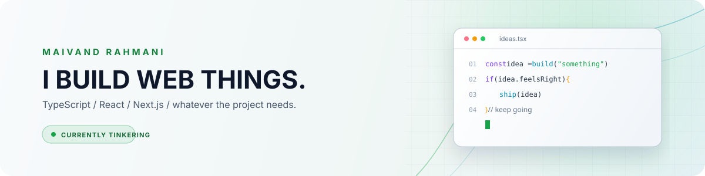
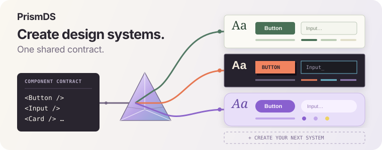
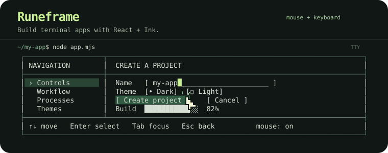
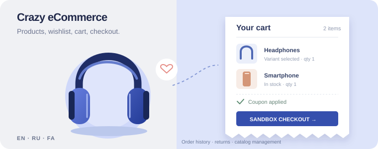
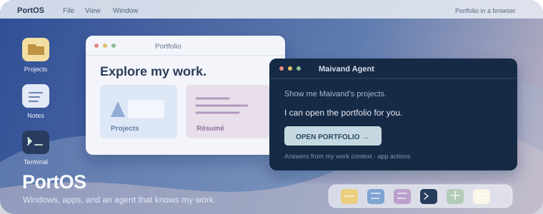
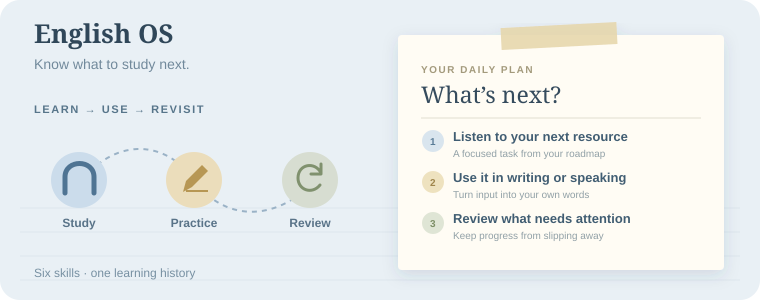
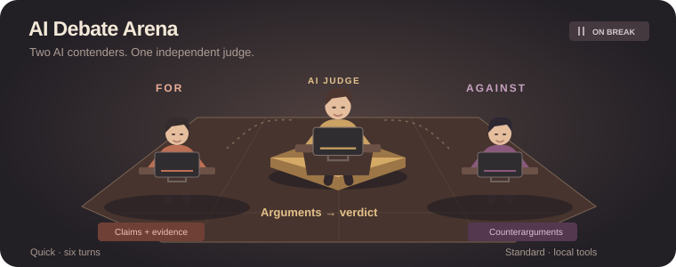

  <a href="https://port-os-seven.vercel.app">
    <picture>
      <source media="(prefers-color-scheme: dark)" srcset="./assets/profile-header.svg" />
      <source media="(prefers-color-scheme: light)" srcset="./assets/profile-header-light.svg" />
      
    </picture>
  </a>

  <a href="https://port-os-seven.vercel.app">Portfolio</a>
  &nbsp;·&nbsp;
  <a href="https://t.me/MaivandR123">Telegram</a>
  &nbsp;·&nbsp;
  <a href="mailto:maivand123r@gmail.com">Email</a>

## Hey, I'm Maivand

I build web apps and product experiments.

I started with frontend work, but I keep wandering into architecture, AI, and
whatever else a project needs. Most of the time I'm using TypeScript, React,
and Next.js.

## Now

AI Debate Arena is on a break for now. I'm currently working on PrismDS and Runeframe.

## Projects

<table>
  <tr>
    <td width="50%" valign="top">
      
      <h3><a href="https://github.com/maivand-rahmani/prism-system">PrismDS</a></h3>
      
A toolkit for creating React design systems under one shared component contract. Each system implements that contract with its own colors, typography, component styles, states, and motion. You can create and validate a system, preview it in the showcase, publish it as an npm package, and use <code>prism-ds</code> to connect it to a product.

      
<code>TypeScript</code> <code>React</code> <code>Design systems</code> <code>pnpm</code>

    </td>
    <td width="50%" valign="top">
      
      <h3><a href="https://github.com/maivand-rahmani/runeframe">Runeframe</a></h3>
      
A framework for building terminal apps with React and Ink. It provides screen navigation, reusable widgets, themes, mouse controls, and keyboard shortcuts, with focus handling and live process output built in.

      
<code>TypeScript</code> <code>React</code> <code>Ink</code> <code>Node.js</code>

    </td>
  </tr>
  <tr>
    <td width="50%" valign="top">
      
      <h3><a href="https://github.com/maivand-rahmani/crazy-eCommerce-project">Crazy eCommerce</a></h3>
      
A full-stack e-commerce platform with a real storefront and a private admin console. It handles products and variants, cart, wishlist, multilingual routes, sandbox checkout, orders and returns, users, coupons, reviews, and a PostgreSQL database behind it.

      
<code>Next.js</code> <code>React</code> <code>Prisma</code> <code>PostgreSQL</code>

      <a href="https://crazy-e-commerce-project.vercel.app">Open the live project →</a>
    </td>
    <td width="50%" valign="top">
      
      <h3><a href="https://github.com/maivand-rahmani/PortOS">PortOS</a></h3>
      
A portfolio that works like a desktop in your browser. It has floating windows and apps for projects, notes, résumé, contacts, and a terminal. Its AI agent answers from my work context, opens apps, and drafts notes.

      
<code>Next.js</code> <code>TypeScript</code> <code>Feature-Sliced Design</code>

      <a href="https://port-os-seven.vercel.app">Visit PortOS →</a>
    </td>
  </tr>
  <tr>
    <td width="50%" valign="top">
      
      <h3><a href="https://github.com/maivand-rahmani/English-OS">English OS</a></h3>
      
My attempt to build a personal system for learning English. It brings resources, a learning roadmap, practice, review, and progress into one place, so the next step is clear.

      
<code>Learning system</code> <code>Roadmap</code> <code>Product thinking</code> <code>Next.js</code>

    </td>
    <td width="50%" valign="top">
      
      <h3><a href="https://github.com/maivand-rahmani/ai-debate-arena">AI Debate Arena · On break</a></h3>
      
On break for now. Two AI contenders debate with evidence, and an independent AI judge scores the result. Quick is a six-turn first look; Standard runs locally with web search, URL fetch, and code tools.

      
<code>Next.js</code> <code>TypeScript</code> <code>AI SDK</code> <code>React Three Fiber</code>

    </td>
  </tr>
</table>

## Things I use

`TypeScript` `JavaScript` `React` `Next.js` `Tailwind CSS` `Node.js` `Prisma`
`PostgreSQL` `Git` `Vitest`  
`And a lot of libraries and stuff :)`

## Find me here

- [Portfolio](https://port-os-seven.vercel.app)
- [Telegram](https://t.me/MaivandR123)
- [Email](mailto:maivand123r@gmail.com)
